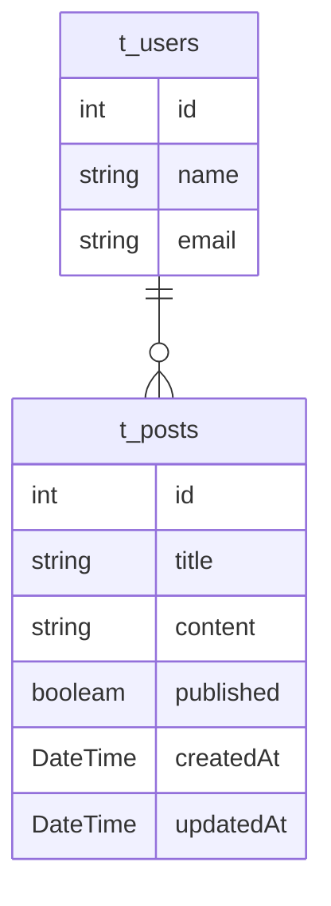

```mermaid
erDiagram
t_users ||--o{ t_posts: ""

t_users {
  int id
  string name
  string email
}

t_posts {
  int id
  string title
  string content
  booleam published
  DateTime createdAt
  DateTime updatedAt
}

```