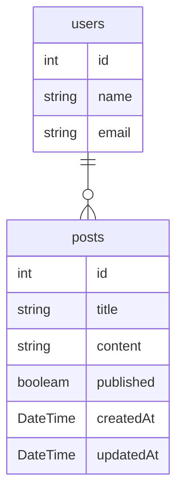

```mermaid
erDiagram
users ||--o{ posts: ""

users {
  int id
  string name
  string email
}

posts {
  int id
  string title
  string content
  booleam published
  DateTime createdAt
  DateTime updatedAt
}

```